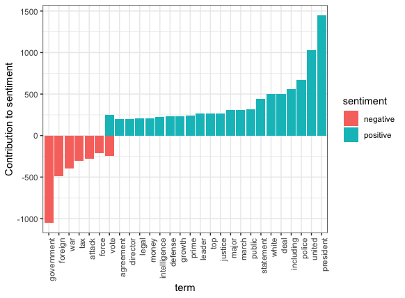
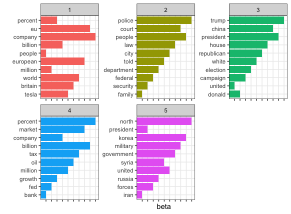
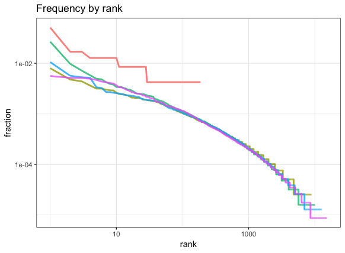

[](http://quantlet.de/)

## [](http://quantlet.de/) **DEDA_Class_2018_StGallen_LDA_News** [](http://quantlet.de/)

```yaml

Name of Quantlet:  DEDA_Class_2018_StGallen_LDA_News
 
Published in:      Smart Data Analytics
  
Description:       Short exploration of text mining, sentiment analysis and LDA for topic modelling.
 
Keywords:          LDA, tidytext, sentiments, text, R, newspaper, articles

See also:          

Author:            Antoine Gex-Fabry, Jonas Clemens, Marco Hassan
  
Submitted:         Fri, November 02 18 by Antoine Gex-Fabry
  
Datafile:          news_en.csv
  
Input:  
  
Output:  
  
Example:  

```








